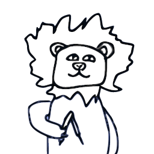

# Honza Botner

Bot for student FIT CTU discord server.

## Contributing

The easiest way to contribute to this project is to [file issues][issues].

You can also contribute code as described in [Contributing](CONTRIBUTING.md).

## Features

This is a list, not necessarily exhaustive, of the features of this bot.

### Commands

You can always see a help message for a specific command by sending a message `::help <command (subcommand ...)>`.

#### `::poll`

This command creates different types of polls.
That can be useful to easily create a message that stands out and that has automatically added all the poll options' reactions to it.
A poll can be of two types, `::poll abc` (multichoice poll) or `::poll yesno` (simple yes or not poll).
The bot can also guess the type without you specifying it.

#### `::voice`

This command allows you to create (`::voice add`) your custom voice channel
that will be available to join for the next 30 seconds.
After somebody joins, it stays in the server until somebody is in it.
You can also edit (`::voice edit`) the name and/or limitations of such a channel,
but be aware that Discord has rate limits that prevent editing multiple times in a row.

#### `::emotes`

We collect stats on using custom emotes in the server.
That helps us in the matter of deciding what emoji we can erase and what is top-notch.
You can see the stats using `::emotes`.

#### `::bot`

Using `::bot info`,
member can see basic info about the bot,
mainly a link to this repository and a link to the issue tracker.

#### `::fun`

Provides some basic commands for entertainment.
Currently only `::fun choose` is available.
This command picks one of the provided options.

#### Mods' commands

Besides already shown commands,
mods can use a few more commands that help to moderate the server.
Such commands provide the ability to:

- **channel** cloning,
- **member** counting,
- **message** sending, editing, reacting, and binding reactions to get some roles,
- **bot** activity updating.

### Discord events features

Beside the commands,
this bot also has special features,
that can handle Discord events or other 3rd party features.

#### Roles granting

We use Discord events to handle emotes that has been bound to messages,
which gains members some specific roles.
That means if the member add a reaction to a special message,
the bot grants them some specific role (e.g. `bi-pa1`) which permits the member to see such a channel.

Similarly, this is how authentication works,
only with added auth step.

#### Custom voice deletion

Whenever a user leaves a custom voice channel,
we check if somebody is still there and if not,
the bot removes the channel.
This feature helps us keep custom voice channels clean of unused channels.

#### Pinning

Similarly to role granting,
we handle adding a 📌 (`:pushpin:`) reaction in a way that we count the number of members (some members, such as teachers, has bigger weight)
and if it reaches the specified threshold,
the bot pins the message so other people can see it in the future.

### 3rd party features

We do not yet provide any functionality that works with a 3rd party features.

## License

Licensed under the [MIT License](LICENSE).

[issues]: https://github.com/fit-ctu-discord/honza-botner/issues
